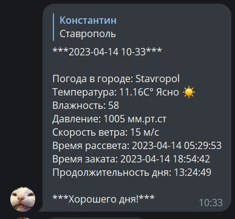

# Weather
Telegram bot weather forecast

# Getting Started

This project uses [openweathermap](https://openweathermap.org/api). Get a token and write to a variable in the config file.

To create and configure a bot, use the telegram bot https://t.me/BotFather. Get a token and write to a variable in the config file.

Run the file main_weather_tg_bot and go to your telegram bot
